# **Coastal Guitar Tuition**

[View the deployed website here](https://dan555-33.github.io/coastal-guitar-tuition/index.html)

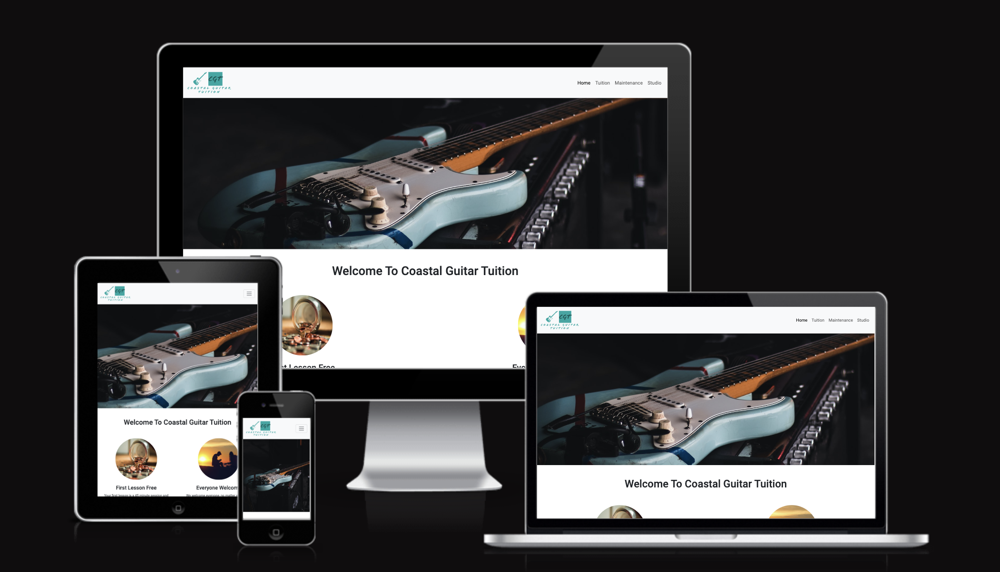

## **Site Overview**

Coastal Guitar Tuition is a business based in North Wales in the coastal town of Prestatyn. The primary business goal is to provide guitar lessons to the local community, providing lessons to students of all ages and abilities. The business also provides guitar maintenance and has a fully functional recording studio which is open not only to students of Coastal Guitars, but to the wider community as well.

## **Planning stage**

### **Target Audiences**

* Users interested or wanting to learn to play guitar
* Users interested in guitar maintenance and setup
* Users wanting to use the studio record music

### **User Stories**

* As a First Time Visitor, I want to be able to see the purpose of the site.
* As a First Time Visitor, I want to be able to navigate throughout the site with ease.
* As a First Time Visitor, I want to be able to find the services you provide with ease.
* As a First Time Visitor, I want to be able to find a price list with ease
* As a First Time Visitor, I want to be able to contact you with ease
* As a First Time Visitor, I want to be able to visit/follow you on social media

### **Site Aims**

* To inform the user about Coastal Guitar Tuition and its services
* To have a website that is simple to use and easy to navigate
* To have a list of prices for guitar lessons
* To have social media links in the footer of each page. Thus enables the user to follow Coastal Guitars via the various social networks and be up to date with the latest information. It also gives them a platform to reach out on

### **Wireframes**

Home Page Desktop View

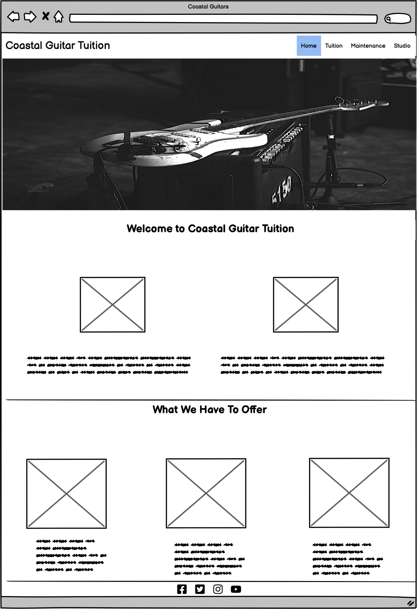

Home Page Mobile

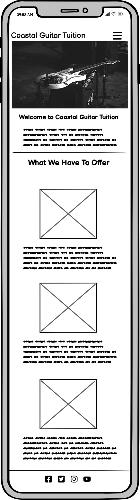

Tuition Desktop View

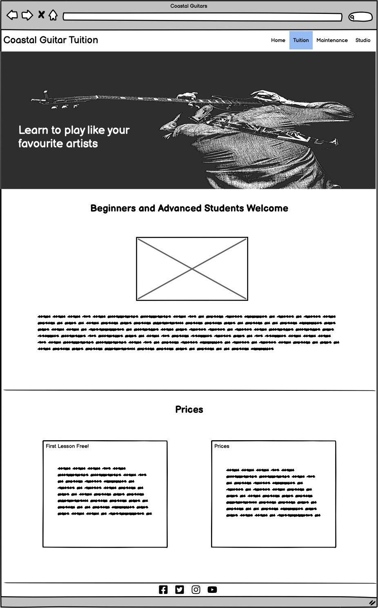

Tuition Mobile View

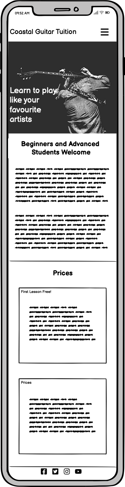

Maintenance Desktop View

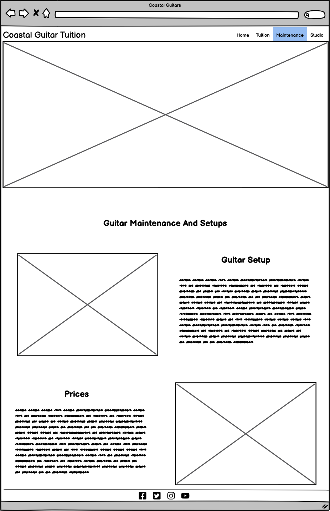

Maintenance Mobile View

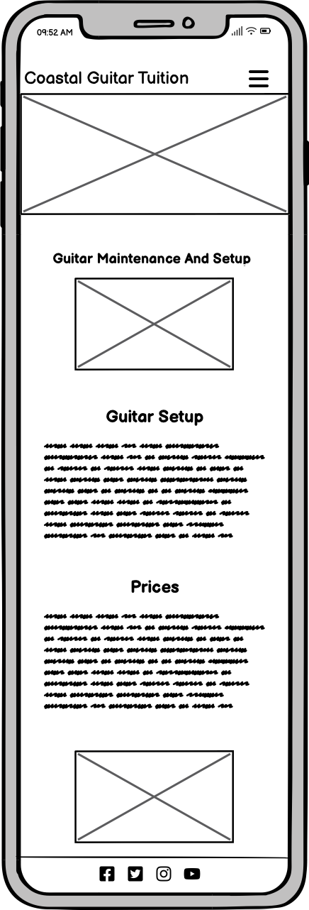

Studio Desktop View

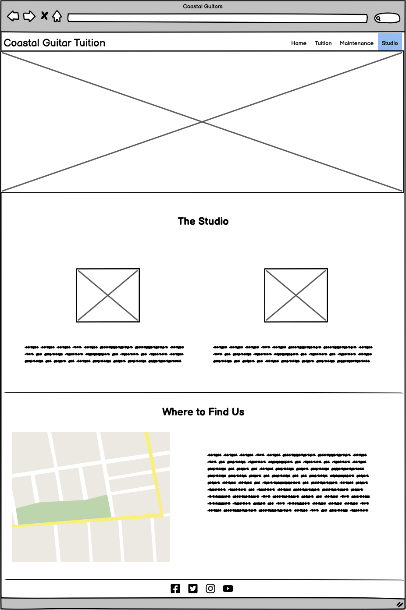

Studio Mobile View

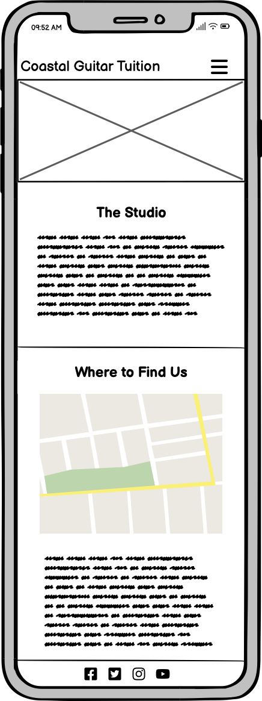

### **Color Scheme**

The main colours used throughout the site are surf green and white as it is the colour of the company’s logo. White text against the green background provides a good contract and allows the text to be easy to read.

## **Typography**

The Roboto font is the main font used throughout the whole website with Sans Serif as the fallback font in case for any reason the font isn't being imported into the site correctly from google fonts. Roboto a clean, friendly font used often used in web development, meaning it is aesthetically pleasing and suitable choice for this site.

## **Imagery**

Imagery is important, it’s what the user is immediately drawn to. The large hero image has been chosen to capture the user’s attention. It has a clear subject matter, that being the guitar. It is also in colours which direcly link to the company’s colours. The imagery used throughout the site relates to guitars, guitar tuition and the studio.

## **Current Features Common to all pages**

### Navigation Bar

Desktop view:
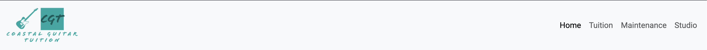

Mobile view:
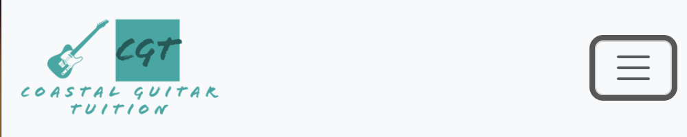

Mobile view expanded:
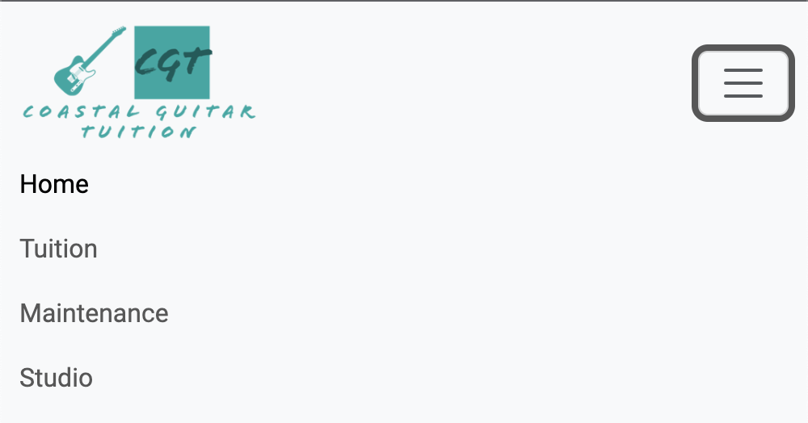

* On each page the user is given links to every page on the website, thse links stay in the same order and the current selected page name is darker page to show the user which page they are currently on.
* Each page option is clearly labelled easy to read and the name corresponds to the page content.
* On mobile screen the page links are reduced to a hamburger menu to optimize screen space and the user experience.
* The company logo is also alink to the home page on every page.
* The off-white background helps the green of the company logo as well as the links in the navigation stand out and also makes them easy to read.

### Footer

* The footer is very minimalistic. The footer has links to the four main social networks, Facebook, Instagram, YouTube and Twitter. It uses their logogs rather than their names with are univerally instantaly recognisable.
* The icons are in the same green #00A3A3 colour as as the rest of the website to keep it uniform with the companys branding further enhancing the compnays colours and identity.

## **Other Features**

### Home - Hero Image

* This image was picked for several reasons. Firstly the guitar is a Fender Stratocaster, arguably the most famous and recognisable guitar on the planet. Most people, even if they dont know the make and model of the guitar, they know it is a guirar. Scondly the clearly links to what the site is trying to promote and offer, this being guitar lessons. Thirdly, the colour of the guitar is that of the the company colours. The image is also a road worn guitar, its not shiny and new and shows a guitar that has had many hours of playing and enjoyment.
* The image scales down nicely on smaller devices. Whilst you can't see the whole guitar, you can still see the body and clearly identify what it is.

### Home - Welcome Message

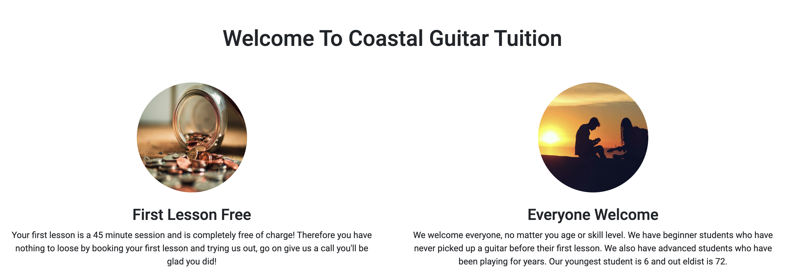

* Included is a welcome message to the website. With two further headings and pictures underneath.
* The paragprah's are short and quickly introduce what the company is offering. It informs the user that their first lesson is free and that everyone is welcome to study at Coastal Guitars. Having the first lesson free is trying to show the user we are passionate about guitar teaching and not merely motivated by money, but for the love and passion for the instrument.

### What We Have To Offer

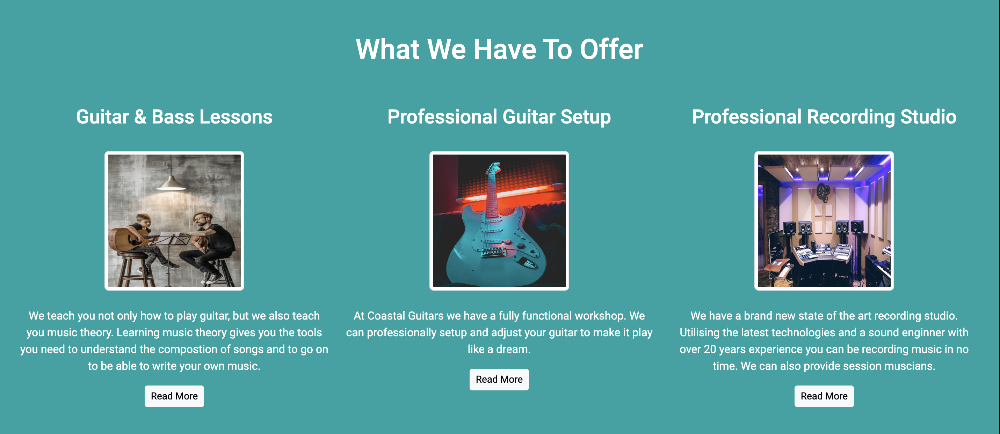

* This section of the Home page provides a quick overview of what the business has to offer. Each section had a brief description of what is on offer with an image that corresponds. There is also a link below the images to take the user to the corresponding page on the website to find out more information about that service.
* The green section is a matches the theme throughout the website and is consistenct with the companys branding.