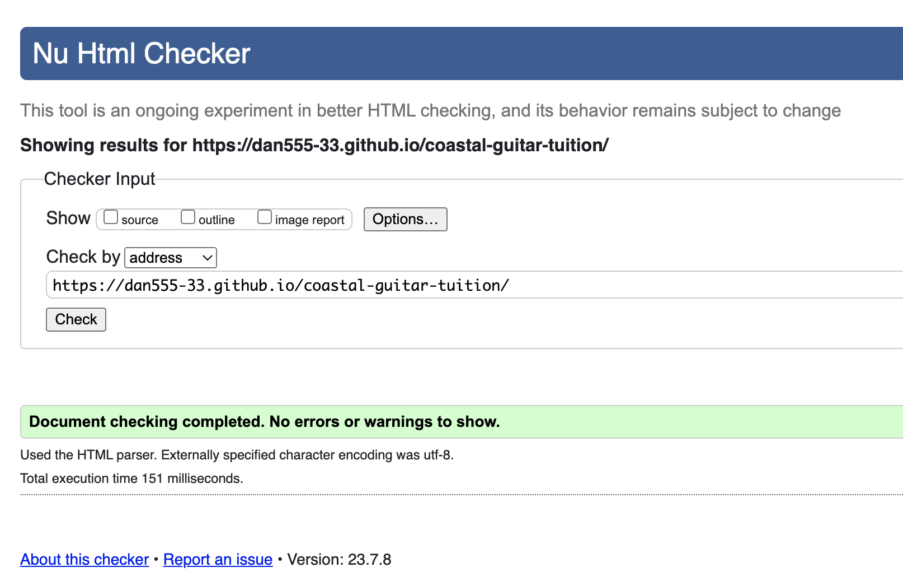
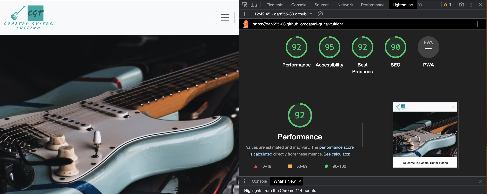

# **Coastal Guitar Tuition**

[View the deployed website here](https://dan555-33.github.io/coastal-guitar-tuition/index.html)

## **Site Overview**

Coastal Guitar Tuition is a business based in North Wales in the coastal town of Prestatyn. The primary business goal is to provide guitar lessons to the local community, providing lessons to students of all ages and abilities. The business also provides guitar maintenance and has a fully functional recording studio which is open not only to students of Coastal Guitars, but to the wider community as well.

## **UX Planning stage**

## Target Audiences

* Users interested or wanting to learn to play guitar
* Users interested in guitar maintenance and setup
* Users wanting to use the studio record music

## User Stories

* As a First Time Visitor, I want to be able to see the purpose of the site.
* As a First Time Visitor, I want to be able to navigate throughout the site with ease.
* As a First Time Visitor, I want to be able to find the services you provide with ease.
* As a First Time Visitor, I want to be able to find a price list with ease
* As a First Time Visitor, I want to be able to contact you with ease
* As a First Time Visitor, I want to be able to visit/follow you on social media

## Site Aims

* To inform the user about Coastal Guitar Tuition and its services
* To have a website that is simple to use and easy to navigate
* To have a list of prices for guitar lessons
* To have social media links in the footer of each page. Thus enables the user to follow Coastal Guitars via the various social networks and be up to date with the latest information. It also gives them a platform to reach out on

## **Wireframes**

Home Page Desktop View

Home Page Mobile

Tuition Desktop View

Tuition Mobile View

Maintenance Desktop View

Maintenance Mobile View

Studio Desktop View

Studio Mobile View

## **Design**

## Color Scheme

The main colours used throughout the site are surf green and white as it is the colour of the company’s logo. White text against the green background provides a good contract and allows the text to be easy to read. The business is also very close to the beech front and the colour choices have been chosen to reflect this.

## Typography

The Roboto font is the main font used throughout the whole website with Sans Serif as the fallback font in case for any reason the font isn't being imported into the site correctly from google fonts. Roboto a clean, friendly font used often used in web development, meaning it is aesthetically pleasing and suitable choice for this site.

## Imagery

Imagery is important, it’s what the user is immediately drawn to. The large hero image has been chosen to capture the user’s attention. It has a clear subject matter, that being the guitar. It is also in colours which direcly link to the company’s colours. The imagery used throughout the site relates to guitars, guitar tuition and the studio.

## **Current Features Common to all pages**

## Navigation Bar

Desktop view:

Mobile view:

Mobile view expanded:

* On each page the user is given links to every page on the website, thse links stay in the same order and the current selected page name is darker page to show the user which page they are currently on.
* Each page option is clearly labelled easy to read and the name corresponds to the page content.
* On mobile screen the page links are reduced to a hamburger menu to optimize screen space and the user experience.
* The company logo is also alink to the home page on every page.
* The off-white background helps the green of the company logo as well as the links in the navigation stand out and also makes them easy to read.

## Footer

* The footer is very minimalistic. The footer has links to the four main social networks, Facebook, Instagram, YouTube and Twitter. It uses their logogs rather than their names with are univerally instantaly recognisable.
* The icons are in the same green #00A3A3 colour as as the rest of the website to keep it uniform with the companys branding further enhancing the compnays colours and identity.

## **Other Features**

## Home - Hero Image

* This image was picked for several reasons. Firstly the guitar is a Fender Stratocaster, arguably the most famous and recognisable guitar on the planet. Most people, even if they dont know the make and model of the guitar, they know it is a guirar. Scondly the clearly links to what the site is trying to promote and offer, this being guitar lessons. Thirdly, the colour of the guitar is that of the the company colours. The image is also a road worn guitar, its not shiny and new and shows a guitar that has had many hours of playing and enjoyment.
* The image scales down nicely on mobile devices. Whilst i've not created a media query for tablets the image responds and displays nicely and you can still see the body of the guitar and clearly identify what it is.

## Home - Welcome Message

* Included is a welcome message to the website. With two further headings and pictures underneath.
* The paragprah's are short and quickly introduce what the company is offering. It informs the user that their first lesson is free and that everyone is welcome to study at Coastal Guitars. Having the first lesson free is trying to show the user we are passionate about guitar teaching and not merely motivated by money, but for the love and passion for the instrument.

## Home - What We Have To Offer

* This section of the Home page provides a quick overview of what the business has to offer. Each section had a brief description of what is on offer with an image that corresponds. There is also a link below the images to take the user to the corresponding page on the website to find out more information about that service.
* The green section is a matches the theme throughout the website and is consistenct with the companys branding.
* The images have a white border making them standout against the green background.
* The text is in this section is white, which is in contrast to the green background making it easy to read.

## Future Enhancements

There are several enhancements or changes I would make to the website to improve it

* A booking system, to allow people to book their first lesson
* A contact form so people can request a call or email back to request more information
* I am unhappy with the layout of the maintenance page. Ideally I would have liked images that show guitars being worked on. However, selection was limited without paying for a creating the images myself.
* The maintenance page also strays from the layout of the rest of the site. I would potentially rework this page to improve its aesthetics.

## **Technologies Used**

## Languages

* [HTML5](https://en.wikipedia.org/wiki/HTML5)
* [CSS3](https://en.wikipedia.org/wiki/CSS)

## Frameworks, Libraries & Programs Used

* [Google Fonts](https://fonts.google.com/) - provides the use of the Roboto font for this website.

* [Font Awesome](https://fontawesome.com/) - used for the social network icons.

* [Github](https://github.com/Dan555-33/coastal-guitar-tuition) - was used to store this website and all related documents.

* [CodeAnywhere](https://app.codeanywhere.com/) - used to code the website.

* [Balsamiq](https://balsamiq.com/) - used to create the wireframes found in the readme.

* [Unsplash photo](https://unsplash.com/) - all images on the website are taken from unsplash and are free to use.

* [Google maps](https://www.google.com/maps) - was used to import and embed the business location.

* [Bootstrap 5.3](https://getbootstrap.com/docs/5.3/getting-started/introduction/) - was used for a lot of elements on the site, including the navbar and responsive containers.

* [Bytes](https://ui.dev/amiresponsive) - to see the site on different screen size and screenshot used in README.

* [Adobe Express](https://express.adobe.com/) - was used to design the company logo.

## **Testing and Validation**

* Tested on Chrome, Safari and Microsoft Edge desktop version browsers
* Chrome Developer Tools are used to test the responsiveness on: Desktop, Laptop, iPhone XE, XR, X 12 Pro, Samuung Galaxy S8, Galaxy S20 Ultra, Galaxy fold, iPad, Ipad Mini, Ipad Air and iPad Pro.
* All links to external pages open and all links within the website work as designed.

## Validating HTML

The W3C Markup Validation Service was used to check for html coding errors within the site. The resutls are detailed below:

* [HTML](https://validator.w3.org/#validate_by_uri)- Each page was checked and validated by by URI.

* index.html

* tuition.html

* maintenance.html

* studio.html

## Validating CSS

The W3C CSS Validation Service was used to check for CSS coding errors.

* [CSS](https://jigsaw.w3.org/css-validator/#validate_by_input)- Each page was check and validaed by by direct input.

## Lighthouse

* Each page was test through the lighthouse tool. The results are detailed below:

* index.html
  

* tuition.html
  

* maintenance.html
  

* studio.html
  

Overall performance evaluated by lighthouse is very good and evetyhing is withing the green range. There was initially and issue with the index page returning a performance value of 72. Lighthouse indicated it was an issue with Font Awesome icons which were on the headings First Lesson Feee and Everyone Welcome. I immediately decided to remove these as the icons added nothing extra that the pictures above. Immediately upon removing them and re-running throught lighthouse the perfomance increased to 92% which is a good acceptable figure.

## **User Story Testing**

## Testing User Stories from UX planning**

1. As a First Time Visitor, I want to be able to see the purpose of the site.
   
* As soon as you land on the index page you are greeted with the words 'Welcome To Coastal Guitar Tuition'. There is zero ambiguity in this welcome statement and whet you are being welcomed to. The company logo is also in to top left hand corner which also states the company name. Scrolling fown the home age, the last section 'What We Have To Offer', is clear and concise as to ther services being provided.
  
2. As a First Time Visitor, I want to be able to navigate throughout the site with ease.

* Navigation throught the site, whether on mobile or desktop/laptp is straight forward. The utilisation of a bootstrap nabar allows this to happen with ease. Links are easy to see, are clearly labelled and every page is uniform in relation to the nvvigation links in the navbar.

3. As a First Time Visitor, I want to be able to find the services you provide with ease.
 
* Services are briefly detailed on the home page. The user can either use the nav bar to find out additonal information about the services provided or there is a 'Read More' button for each service on the home page.
   
4. As a First Time Visitor, I want to be able to find a price list with ease.

* Price lists are located on thier relative pages. Prices for tuition can be found on the tuition page prices for guitar maintenance can be located on in the maintenance page. Prices are listed in bullet form for ease of reading.
  
5. As a First Time Visitor, I want to be able to contact you with ease

* Links to all social media accounts are in the footer of every page. Users can contact any any social media platform. Alternatively the phone number and address are provided on the studio page.

6. As a First Time Visitor, I want to be able to visit/follow you on social media
* As 

## Bugs

* There is currently one issue I have identified with the site. When switching to mobile on tuition.html there is a spacing issue under the heading Beginners and Advanced Students Welcome. The image dispears as intended to have a better user experience but it appears to leave a larger than intended space between the heading and the paragraph underneath. This can be seen in the picture below.

## **Deployment**

The site was deployed on GitHub pages with the following procedure:

1. From the project's [repository](https://github.com/Dan555-33/coastal-guitar-tuition), go to the **Settings** tab.
2. From the left-hand menu, select the **Pages** tab.
3. Under the **Source** section, select **Deploy from a branch** and then the **Main** branch from the drop-down menu and click **Save**.
4. A message will be displayed to indicate a successful deployment to GitHub pages and a link to the live site is provided which can be found [here](https://dan555-33.github.io/coastal-guitar-tuition/).

## **Credits**

## Media

* All images were taken from [Unsplash photo](https://unsplash.com/)

## Acknowledgements

* I would like to give a big thank you to Iris Smok, who has been incredibly supportive and helpful throughout the project.

